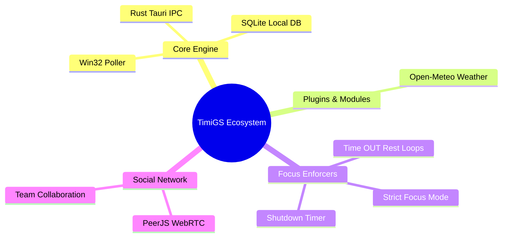

# Welcome to TimiGS

TimiGS is an advanced, privacy-first desktop utility engine designed to seamlessly track productivity, enforce healthy focus habits, and securely sync your operational state across devices using Peer-to-Peer protocols.

## Core Philosophy

Unlike standard web-based activity trackers that aggressively harvest your data to central servers, TimiGS is strictly **Local-First**. 

- **Privacy Inherent**: All tracking data is securely saved in a local SQLite file (`timigs_data.db`). We do not stream your real-time application usage anywhere.
- **Modern Ecosystem**: We utilize **Tauri** (Rust) for zero-cost abstraction with the Windows Kernel, paired with a blazing-fast **Vue.js** frontend.
- **No Subscriptions**: TimiGS operates on open standards and free APIs.

---

## High-Level Architecture

TimiGS is split into resilient subsystems that operate independently but share the primary database bus:

## Quick Start Guide

Getting started is designed to be frictionless.

1. **Download & Install**: Grab the latest setup binary for your OS from our [Releases](https://github.com/BANSAFAn/timiGS-/releases) page.
2. **First Launch**: Upon execution, TimiGS will ask for initial setup (Theme, Language, Autostart).
3. **Passive Mode**: Close the window! TimiGS is built to live entirely in your System Tray and silently record activity in the background.

> [!TIP]
> **Use the Sidebar** on the left to navigate deeper technical topics regarding our specific integrations, or jump into the **Features** tab to explore all tools at your disposal.
