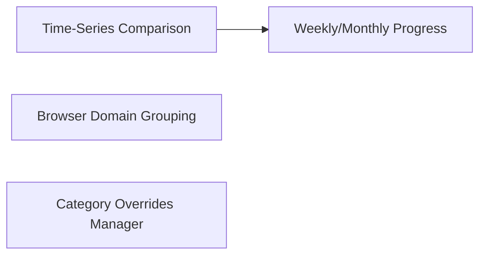

# Analytics: Statistical Progression

The **Analytics Workspace** provides long-term macro tracking, data comparison, and classification override managers to refine how TimiGS classifies your computer usage.

---

## Analytical Features

Analytics is divided into three key workspaces:

### 1. Time-Series Metrics
- **Interactive Bar Charts**: View comparisons of your active daily focus hours over a rolling 7-day or 30-day window.
- **Trend Line Mapping**: Detects whether your weekly focus metrics are increasing or decreasing.
- **App Rank Lists**: Outlines your top 5 most-used applications for the selected period, including their cumulative active hours.

### 2. Smart Browser Domain Grouping
Normally, browsers are classified under a generic "Browser" category. The Analytics parser parses browser window titles (e.g. Chrome, Edge, Firefox, Brave, Safari) to group hostnames:
- Consolidates URLs like `github.com/profile` into a clean `github.com` entry.
- Correctly classifies target domains into specialized categories (e.g., classifying `chatgpt.com` under **AI & Assistants** or `figma.com` under **Creative & Design**).

### 3. Classification Overrides Manager
Because default process categories may not fit every workflow, you can permanently override executable classifications:
- *Example*: You can change `Discord.exe` from **Rest** to **Work** if you utilize it for work-related communication.
- *Example*: Re-classify `Photoshop.exe` from **Creative** to **Work**.
- All historical charts and timeline records update retroactively to match your override preferences.

---

## Exporting Analytics Data

You can extract your compiled analytics metrics directly from this panel. Supported formats include:
- 📊 **CSV**: For spreadsheet audits and pivot charts.
- 📄 **Markdown**: For developers logging daily work diaries.
- 🌐 **JSON/HTML**: For web-ready reporting or backup archives.
