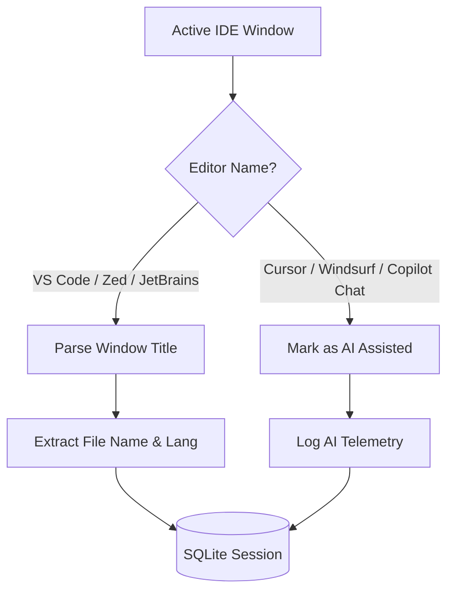

# Coding Workspace: Developer Telemetry

The **Coding Workspace** is a developer-centric telemetry dashboard designed to analyze your active software engineering sessions and balance your manual work against AI coding assistants.

---

## Editor & IDE Integration

TimiGS hooks into active editors and IDE processes to extract granular file-level activity. Unlike standard generic trackers, it maps out exact workspaces:



### 1. Supported Editors & IDEs
- **VS Code & Zed**: Monitors window titles to parse active filenames, folder paths, and project workspaces.
- **JetBrains Suite**: Natively supports IntelliJ, WebStorm, PyCharm, CLion, GoLand, Rider, and PhpStorm.
- **Terminal Editors**: Monitors `Neovim` or `Vim` execution within standard shell containers.

### 2. File & Programming Language Detection
The backend parses the active file extension in your editor window title to group session times by programming language:
- 🦀 **Rust** (`.rs`)
- 🔵 **TypeScript/JavaScript** (`.ts`, `.js`, `.tsx`, `.jsx`)
- 🐍 **Python** (`.py`)
- 🟢 **Go** (`.go`)
- 🎨 **HTML/CSS/Vue/Svelte** (`.html`, `.css`, `.vue`, `.svelte`)
- And dozens of other syntaxes.

---

## AI Assistant Balance (AI vs. Manual)

With the rise of AI-augmented development, TimiGS features a specialized tracker that logs whether you are writing code manually or consulting AI assistants:
- **AI Tracking**: Detects when you context-switch to AI-first editors (like **Cursor** or **Windsurf**) or browser-based assistants (like **ChatGPT**, **Claude**, or **DeepSeek**).
- **Session Split**: Renders a color-coded split progress bar showing the percentage of your session spent in **Manual Development** vs. **AI Assistance**.
- **Insights**: Helps you evaluate whether you are relying too heavily on AI or if AI-guided writing is streamlining your development cycles.

---

## Code Example: Editor Class Identification

To style sessions correctly, the UI groups processes into editor classes:

```typescript
function getEditorBadgeClass(editor: string): string {
  const e = editor.toLowerCase();
  if (e.includes('cursor') || e.includes('windsurf')) return 'editor-ai';
  if (e.includes('code') || e.includes('vs code')) return 'editor-vscode';
  if (e.includes('zed')) return 'editor-zed';
  if (e.includes('neovim') || e.includes('vim')) return 'editor-vim';
  if (e.includes('intellij') || e.includes('webstorm') || e.includes('pycharm')) return 'editor-jetbrains';
  return 'editor-default';
}
```

> [!IMPORTANT]
> **Source Code Security:** TimiGS only reads the title of your active editor window to parse filenames and extensions. It **never** reads your source code files, copy-paste buffers, or terminal contents. Your code remains 100% private.
