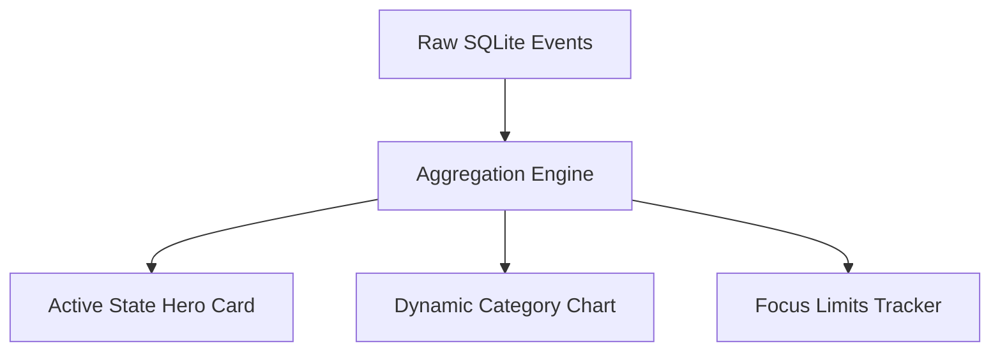

# Dashboard: Command Center

The **Dashboard** is the default landing workspace in TimiGS. It provides an immediate, high-fidelity visual summary of your daily computing state and active focus metrics.

---

## Visual Layout & Subsystems

The Dashboard is engineered to deliver key insights at a glance without forcing you to parse complex timelines or spreadsheets. It aggregates raw activity metrics into three core cards:

### 1. Active State Hero Card
- **Real-Time Display**: Renders the executable name, window title, and active duration of the program currently in focus.
- **Status Indicator**: Features a color-pulsing beacon showing whether your current program is categorized as **Work**, **Rest**, or **Uncategorized**.
- **Interactive Controls**: Allows you to quickly pause/resume tracking directly from the header without hiding the window.

### 2. Category Distribution (Pie Chart)
- **Visual Breakdown**: Uses a dynamic, interactive pie chart to show how your active hours are divided between main categories:
  - 🟩 **Work**: IDEs, terminals, office document software.
  - 🟪 **AI & Assistants**: ChatGPT, Claude, and local AI workflows.
  - 🌸 **Creative & Design**: Figma, Canva, Adobe tools.
  - 🟧 **Utilities & Tools**: System utilities, file managers, local notes.
  - 🟥 **Games**: Natively detected gaming processes.
  - 🟦 **Rest / Entertainment**: Browser entertainment, music players.
- **Micro-Animations**: Hovering over chart sectors highlights active totals and percentages smoothly.

### 3. Focus Limits & Progress
- **Goal Completion**: Compares your cumulative daily productive time against your customizable focus goal (e.g., 4 hours of target work).
- **Progress Gauge**: Renders a fluid, glowing progress bar that transitions from orange to vibrant green as you approach your target.

---

## Under the Hood

The Dashboard updates reactively by subscribing to changes in the Vue `activity` store. Every 2 seconds, the store receives process information from the Tauri IPC layer, updates today's session duration, and triggers a re-render of the chart payload.

> [!TIP]
> Use the Dashboard as a mirror for your daily energy. If you notice the "Rest" category dominating your early hours, it may indicate a need to activate **Focus Mode** or set up **Time Out** rest intervals.
