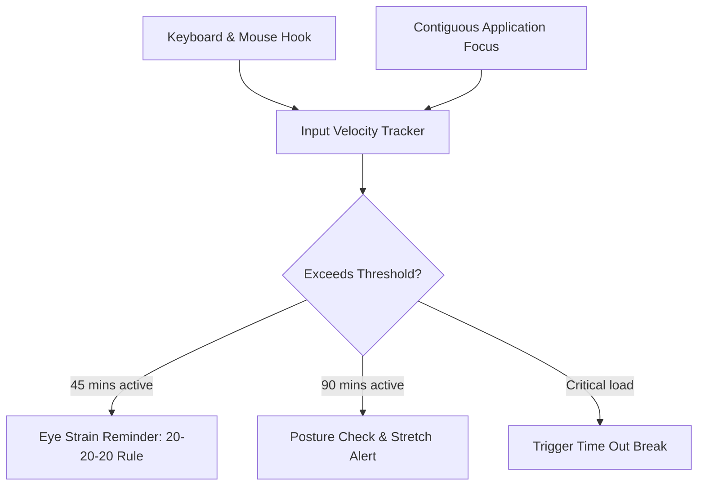

# Doctor Mode: Ergonomic Wellness Assistant

**Doctor Mode** is an automated ergonomic wellness assistant designed to monitor your physical workload and prevent repetitive strain injury (RSI), eye strain, and poor posture habits.

---

## Technical Concept & Triggers

Rather than using generic, time-based clock reminders, Doctor Mode analyzes your **input activity** and **focus continuity** to trigger context-aware ergonomic notifications:

### 1. Eye Strain Prevention (20-20-20 Rule)
- **What it is**: Every 20 minutes of continuous typing/mouse movement, Doctor Mode alerts you to look at something at least 20 feet away for 20 seconds.
- **Visual Alert**: Triggers a non-intrusive system notification or custom HUD tooltip that disappears automatically.

### 2. Stand & Stretch Reminders
- **Continuous Session Monitoring**: If you sit active at your computer for more than 90 consecutive minutes, Doctor Mode will display a window prompting you to stand up, roll your shoulders, and stretch.
- **Physical Health Check**: Prompts you to drink water and check your lower back posture.

---

## Integration with Time Out

Doctor Mode is deeply integrated with the **Time Out** subsystem. If Doctor Mode detects that you have ignored three consecutive stretch notifications, it can be configured to automatically trigger an enforced 5-minute Time Out rest period, forcing you to step away and preserve your physical health.

> [!NOTE]
> All activity monitoring is done client-side. The program simply monitors the delta time since your last keyboard/mouse event and does not log what keys you type, ensuring 100% typing security.
