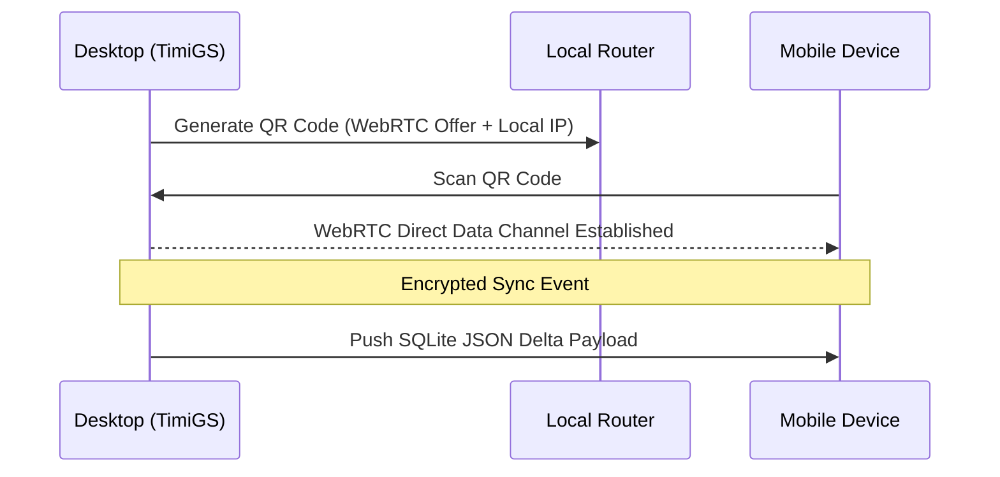

# Secondary Features

TimiGS goes far beyond basic time management. It hosts an array of interconnected features designed to maximize productivity and secure raw data.

## 📊 Activity Tracking & Categorization
The entire engine revolves around high-speed, local SQLite data tracking.
Rather than presenting raw application timers, TimiGS utilizes built-in algorithmic detection to automatically categorize known applications into broad bins like `Games`, `Work`, `Programs`, or `Rest`. This lets you visually identify whether a 4-hour session was productive or wasted without examining every minor executable.

## 🔄 P2P Device Synchronization
You own your data, so it shouldn't have to bounce through a corporate cloud server to reach your phone.

TimiGS provides an independent Sync Tab. You can scan a QR code rendered directly inside the software with any mobile device on the same local network to perform a massive high-speed P2P handover of your database log, giving you offline access to your history remotely.

## 💾 Cloud Auto-Export
If absolute redundancy is critical for your data retention, TimiGS offers local disk backups mapping out to traditional cloud folder structures.

- Extrapolate your databases to generic CSV or human-readable HTML/Markdown formats.
- Enable the **Auto-Export Module** to silently push formatted backups at scheduled intervals (Every Startup, Every Hour, Daily, etc.).

## 🎮 Discord Rich Presence Engine
Showcase your focus to the world automatically.

- The backend Rust engine natively communicates with the local Discord Desktop Client pipeline.
- Whenever you are utilizing a `Work`-categorized application or actively engaged in a Focus loop, TimiGS intercepts the Discord Rich Presence API to display "In Deep Work" directly on your Discord profile, complete with exact elapsed session timers. 
- *This deters notifications and pings from friends during critical moments.*
