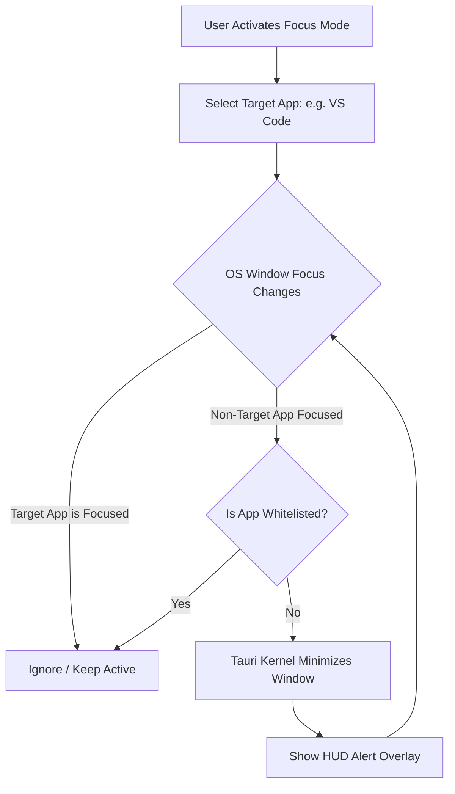

# Focus Mode: Distraction Eliminator

**Focus Mode** is a zero-tolerance distraction blocker built directly into the TimiGS Tauri kernel. When activated, it forces you to remain within a single target workspace by programmatically minimizing other applications.

---

## How Focus Mode Works

Unlike browser extensions that only block specific websites, TimiGS operates at the operating system level, allowing you to select a single "Target Application" (e.g., your IDE) for deep focus:

### 1. Active Window Guard
When a non-target application (like a chat app, social media page, or browser tab) receives focus, the TimiGS background manager immediately catches the system call. If the program isn't whitelisted, the Tauri layer issues a window management command to **minimize** or hide the distraction.

### 2. Custom Whitelists
You can configure a narrow list of allowed auxiliary apps:
- *Example*: Target = `VS Code`, Whitelist = `Terminal`, `Localhost Browser`.
- Any other application that tries to steal your attention will be immediately minimized.

### 3. Deactivation Challenges
To prevent you from impulsively turning off Focus Mode when you encounter a difficult coding problem, you can lock deactivation behind:
- 🔑 **Random String Challenge**: You must type a random 30-character string correctly to disable the mode.
- ⏳ **Timer Lock**: The "Stop" button is completely disabled until a set countdown expires (e.g., 25 minutes).

---

## Technical Safety & Permissions

TimiGS uses standard Win32 window handles (`ShowWindow` with `SW_MINIMIZE` parameter) and Linux display window controls to minimize processes. 

> [!WARNING]
> Focus Mode does **not** terminate or kill your other programs, preventing any risk of unsaved data loss in background applications. It simply pushes them out of your visual workspace.
