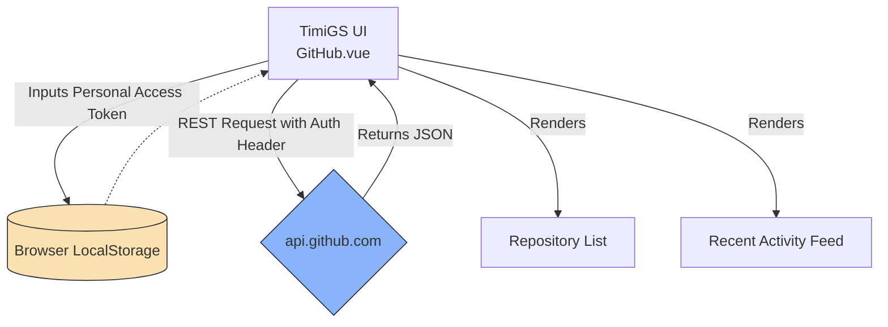

# GitHub Integration

Connect your GitHub account to TimiGS to track your coding activity, view repository statistics, and monitor your development workflow. The GitHub integration provides insights into your commits, pull requests, and overall coding patterns.

## Overview

The GitHub integration offers:
- **Activity Tracking** - Monitor commits, pull requests, issues, and more
- **Repository Overview** - View your repositories with stats
- **Recent Activity Feed** - See your latest GitHub actions
- **Coding Insights** - Correlate coding activity with overall productivity

### API Integration Architecture



## Getting Started

### Prerequisites

- A GitHub account
- Internet connection
- GitHub Personal Access Token

### Creating a Personal Access Token

1. Go to [GitHub Settings → Tokens](https://github.com/settings/tokens)
2. Click **Generate new token** → **Generate new token (classic)**
3. Give your token a descriptive name (e.g., "TimiGS Integration")
4. Set an expiration date (recommended: 90 days or No expiration for convenience)
5. Select the following scopes:
   - `repo` - Full control of private repositories
   - `read:user` - Read user profile data
   - `user:email` - Access user email addresses
6. Click **Generate token**
7. **Copy the token immediately** - you won't be able to see it again!

> [!IMPORTANT]
> Keep your Personal Access Token secure! It provides access to your GitHub account. Never share it publicly or commit it to a repository.

### Connecting to TimiGS

1. Open TimiGS and navigate to the **GitHub** page
2. Paste your Personal Access Token in the input field
3. Click **Connect GitHub**
4. Your GitHub profile will load automatically
5. You'll see your avatar, username, and repositories

> [!TIP]
> If you see "Invalid token" error, double-check that you copied the entire token and that it has the required scopes.

## Features

### 👤 User Profile

Once connected, you'll see:
- **Profile Picture** - Your GitHub avatar
- **Display Name** - Your GitHub name
- **Username** - Your GitHub handle (@username)

### 📁 Repository Overview

View your repositories with key information:
- **Repository Name** - The name of each repo
- **Description** - Project description
- **Primary Language** - Main programming language with color coding
- **Stars** ⭐ - Number of stars the repository has received
- **Forks** 🍴 - Number of times the repository has been forked
- **Owner Avatar** - Repository owner's profile picture

> [!NOTE]
> The repository list shows your 6 most recently updated repositories. This includes both public and private repos you have access to.

### 📊 Recent Activity Feed

Track your latest GitHub actions:

**Supported Event Types:**
- **📤 Push Events** - Commits pushed to repositories
- **✨ Create Events** - New branches or tags created
- **🔀 Pull Request Events** - PRs opened, closed, or merged
- **📋 Issues Events** - Issues created or updated
- **📦 Other Events** - Various GitHub activities

**Activity Details:**
- Repository name
- Time ago (e.g., "2h ago", "3d ago")
- Specific action details (commit messages, PR titles, etc.)
- Commit SHAs for push events

### 🔄 Refresh Activity

Click the **🔄 Refresh** button to manually update your activity feed with the latest events from GitHub.

## Language Color Coding

Repositories are color-coded by their primary programming language:

| Language | Color |
|----------|-------|
| JavaScript | 🟡 Yellow |
| TypeScript | 🔵 Blue |
| Python | 🔵 Dark Blue |
| Rust | 🟤 Brown/Orange |
| Go | 🔵 Cyan |
| Java | ☕ Brown |
| C++ | 🌸 Pink |
| C | ⚫ Gray |
| C# | 🟢 Green |
| Ruby | 🔴 Red |
| PHP | 🟣 Purple |
| Swift | 🟠 Orange |
| Kotlin | 🟣 Purple |
| Vue | 🟢 Green |
| HTML | 🟠 Orange |
| CSS | 🟣 Purple |
| Shell | 🟢 Light Green |
| Dart | 🔵 Teal |

## Activity Event Types

### Push Events

When you push commits to a repository:
- Shows up to 3 most recent commits
- Displays commit SHA (first 7 characters)
- Shows commit message
- Indicates if there are more commits ("+X more commits")

**Example:**
```
📤 username/repository-name
   a1b2c3d  Fix bug in authentication
   e4f5g6h  Add new feature
   i7j8k9l  Update documentation
   +5 more commits
```

### Pull Request Events

When you create, update, or merge pull requests:
- Shows PR action (opened, closed, merged)
- Displays PR title
- Links to the repository

### Create Events

When you create new branches or tags:
- Shows what was created
- Repository information

### Issues Events

When you create or update issues:
- Shows issue action
- Repository information

## Security & Privacy

### Token Storage

> [!IMPORTANT]
> **Your GitHub token NEVER leaves your device.** It's stored in browser localStorage and used only for direct API calls to GitHub. TimiGS has no backend server that could intercept or store your token.

**Implementation Code:**

```typescript
// Github.vue - Token storage (local only)
async function connectGitHub() {
  if (!githubToken.value) return;
  
  // Direct API call to GitHub - no intermediary
  const response = await fetch("https://api.github.com/user", {
    headers: { Authorization: `Bearer ${githubToken.value}` }
  });
  
  if (response.ok) {
    githubUser.value = await response.json();
    // Store token in localStorage ONLY - never sent to TimiGS
    localStorage.setItem("github_token", githubToken.value);
    isConnected.value = true;
  }
}

// Disconnect - removes from localStorage
function disconnectGitHub() {
  localStorage.removeItem("github_token");
  githubToken.value = "";
  githubUser.value = null;
  events.value = [];
  isConnected.value = false;
}
```

**How It Works:**
1. You paste your token into the input field
2. Token is stored in browser's localStorage
3. All GitHub API requests include this token
4. Requests go **directly** from your browser to `api.github.com`
5. TimiGS code runs in your browser - no server involved

- ✅ Tokens stored in browser localStorage only
- ✅ Tokens never sent to TimiGS servers (there are none!)
- ✅ All API calls go directly from your browser to GitHub
- ✅ You can disconnect and clear token at any time

### Token Permissions

The requested token scopes allow TimiGS to:
- ✅ Read your public and private repository information
- ✅ Read your user profile
- ✅ Read your activity events
- ❌ **Cannot** push code or make changes to repositories
- ❌ **Cannot** delete repositories
- ❌ **Cannot** modify organization settings

**API Calls Made (All Direct to GitHub):**

```typescript
// Fetch user profile
const response = await fetch("https://api.github.com/user", {
  headers: { Authorization: `Bearer ${githubToken.value}` }
});

// Fetch repositories
const response = await fetch(
  `https://api.github.com/users/${username}/repos?sort=updated&per_page=20`,
  { headers: { Authorization: `Bearer ${githubToken.value}` } }
);

// Fetch activity events
const response = await fetch(
  `https://api.github.com/users/${username}/events?per_page=20`,
  { headers: { Authorization: `Bearer ${githubToken.value}` } }
);
```

**Network Traffic Analysis:**
- Open DevTools → Network tab
- You'll see requests ONLY to `api.github.com`
- No requests to TimiGS servers
- Your token is in request headers, visible only to GitHub

> [!IMPORTANT]
> TimiGS only reads data from GitHub. It cannot make changes to your repositories, issues, or pull requests.

### Revoking Access

To revoke TimiGS access to your GitHub account:

**Method 1: From TimiGS**
1. Go to the GitHub page in TimiGS
2. Click **Disconnect**
3. Your token is removed from localStorage

**Method 2: From GitHub**
1. Go to [GitHub Settings → Tokens](https://github.com/settings/tokens)
2. Find the TimiGS token
3. Click **Delete**
4. Confirm deletion

## API Details

### GitHub REST API

TimiGS uses the **GitHub REST API v3** for all operations:

**Endpoints Used:**
- `GET /user` - Fetch authenticated user profile
- `GET /users/{username}/repos` - List user repositories
- `GET /users/{username}/events` - List user activity events

### Rate Limits

GitHub API has rate limits for authenticated requests:
- **5,000 requests per hour** for authenticated users
- **60 requests per hour** for unauthenticated users

> [!NOTE]
> TimiGS uses very few API calls. Typical usage:
> - 1 call to load user profile
> - 1 call to load repositories
> - 1 call to load activity (refreshed manually)
> 
> You're unlikely to hit rate limits under normal usage.

### Checking Rate Limit

If you're concerned about rate limits, you can check your current usage:
1. Open browser Developer Tools (F12)
2. Go to the Network tab
3. Look for GitHub API responses
4. Check the `X-RateLimit-Remaining` header

## Troubleshooting

### "Invalid token" Error

If you see this error:
1. Verify you copied the entire token
2. Check that the token hasn't expired
3. Ensure the token has the required scopes (`repo`, `read:user`, `user:email`)
4. Generate a new token if needed

### No Repositories Showing

If your repositories don't appear:
1. Check that you have repositories on GitHub
2. Verify the token has `repo` scope
3. Try refreshing the page
4. Check browser console for errors

### Activity Feed Empty

If no activity appears:
1. Verify you have recent GitHub activity
2. Check that the token is still valid
3. Click the Refresh button
4. Check your internet connection

### Connection Lost

If the connection is lost:
1. Check if your token was revoked on GitHub
2. Verify internet connectivity
3. Try disconnecting and reconnecting
4. Generate a new token if the old one expired

## Best Practices

> [!TIP]
> **Token Expiration** - Set a reasonable expiration date for your token (e.g., 90 days) and create a calendar reminder to renew it before it expires.

> [!TIP]
> **Minimal Scopes** - Only grant the scopes TimiGS needs. Don't add extra permissions like `delete_repo` or `admin:org`.

> [!TIP]
> **Regular Monitoring** - Check your GitHub activity feed in TimiGS regularly to stay on top of your coding patterns and productivity.

> [!TIP]
> **Correlation Analysis** - Use the GitHub integration alongside activity tracking to see how coding sessions correlate with other work activities.

## Privacy Considerations

> [!NOTE]
> **Local Processing** - All GitHub data is fetched directly from GitHub's API to your browser. TimiGS servers never see your GitHub data or token.

> [!NOTE]
> **No Data Storage** - GitHub activity is not stored in TimiGS database. It's fetched fresh each time you view the GitHub page.

> [!NOTE]
> **Token Security** - Your Personal Access Token is stored in browser localStorage. Clear your browser data if you're on a shared computer.

## Advanced Usage

### Multiple Accounts

Currently, TimiGS supports one GitHub account at a time. To switch accounts:
1. Disconnect the current account
2. Generate a token for the new account
3. Connect with the new token

### Organization Repositories

If you have access to organization repositories:
- They will appear in your repository list
- Activity from organization repos appears in your feed
- Ensure your token has access to the organization

### Private Repository Access

To track activity on private repositories:
- Ensure your token has the `repo` scope (not just `public_repo`)
- Private repos will appear alongside public ones
- Activity from private repos is included in your feed

## Coding Activity Insights

### Correlation with Productivity

Use GitHub integration to:
- See which days you were most active on GitHub
- Correlate coding sessions with overall app usage
- Identify peak coding hours
- Track project momentum over time

### Workflow Patterns

Analyze your development workflow:
- How often do you commit?
- What's your PR creation pattern?
- When do you review issues?
- Which projects get the most attention?

> [!TIP]
> Combine GitHub activity data with TimiGS activity tracking to get a complete picture of your development workflow, including time spent in IDEs, browsers, and other tools.
