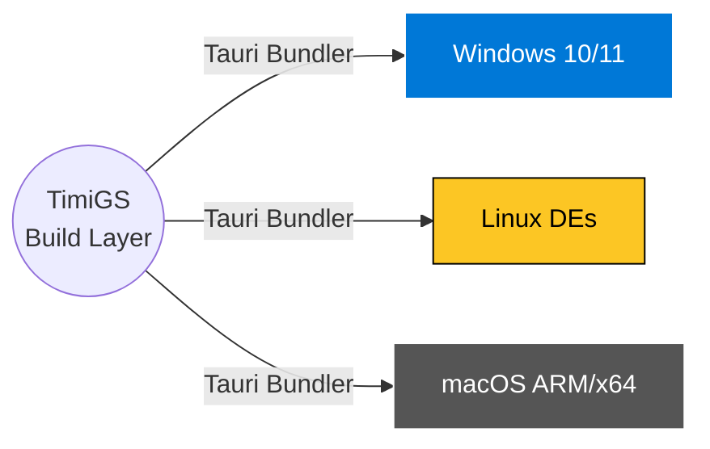

# Universal Installation Guide

TimiGS is cross-compiled using the Rust Toolchain to ensure maximal native performance on any operating system. Below are the definitive steps to deploy TimiGS cleanly securely.

## Native Compatibility Matrix



---

## Windows Configuration

Since TimiGS interacts with Win32 APIs for granular process tracking, Windows is currently the most feature-rich platform.

1. Navigate to the official repository releases page.
2. Download `TimiGS_x64-setup.exe`.
3. Run the installer.
4. **SmartScreen Warning**: Because the open-source community versions lack an expensive Extended Validation (EV) Code Signing Certificate, Windows SmartScreen may incorrectly flag the installer. 
   - *Fix: Click "More Info" -> "Run Anyway".*

> [!CAUTION]
> If a third-party antivirus attempts to block the application, you must whitelist the executable. TimiGS frequently checks the handle of the active UI foreground window, an action that overly-aggressive heuristic scanners sometimes mistake for a keylogger.

---

## Linux Deployments

Linux support treats AppImages as the primary universal format to minimize dependency hell across varying distributions.

### AppImage (Recommended)
1. Download `TimiGS.AppImage`.
2. Assign executable permissions from the terminal:
   ```bash
   chmod +x TimiGS.AppImage
   ```
3. Execute the binary:
   ```bash
   ./TimiGS.AppImage
   ```

### Debian (.deb)
For natively integrated Ubuntu/Debian installs:
```bash
sudo dpkg -i timigs.deb
sudo apt-get install -f # Fixes any missing dependencies
```

---

## macOS Configuration

1. Download the `.dmg` package.
2. Open the package and drag TimiGS into your `Applications` directory.
3. Due to Apple's **Gatekeeper** protocol for unsigned packages:
   - Navigate to `/Applications/` -> Right-Click `TimiGS` -> Click `Open`.
   - Grant the necessary Accessibility Permissions to allow TimiGS to monitor active window states in the background.

## Database File Pathing

If you ever need to manually back up or extract your database files, TimiGS stores operations in standard roaming/local app data directories:
- **Windows**: `C:\Users\%USERNAME%\AppData\Roaming\TimiGS\timigs_data.db`
- **Linux**: `~/.config/TimiGS/timigs_data.db`
- **macOS**: `~/Library/Application Support/TimiGS/timigs_data.db`
