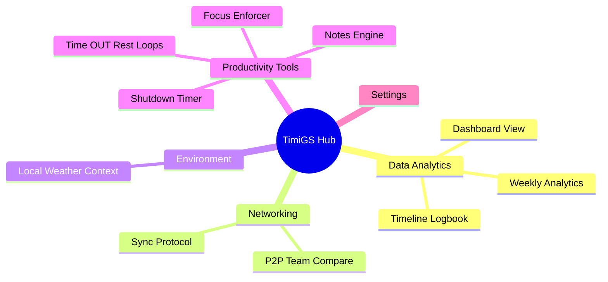

# Interactive Subsystems (Application Tabs)

TimiGS is designed to provide actionable intelligence via several different functional "lenses." Each tab is a self-contained productivity subsystem tailored for specific insights, interconnected through the central Vue Router.

## Application Architecture Map

---

## 1. 🏠 Dashboard (Home)
The primary overview environment. It acts as the command center when you immediately open the application.

- **Active State Monitoring**: Displays your "Active Now" statistics against preset limits.
- **Aggregated Summaries**: Shows today's total active hours, broken out into a dynamic pie chart that aggregates how your time is divided between distinct Categories (`Work`, `Games`, `Rest`, `Programs`).
- **Use Case**: Allows you to judge your focus balance and energy distribution at a glance without diving into heavy spreadsheets or exported metrics.

## 2. ⏳ Timeline
Your daily logbook and chronometric footprint.

- **Granular Activity Rendering**: Provides a highly detailed, minute-by-minute sequential breakdown of exactly what windows and applications were focused on throughout the day. 
- **Use Case**: This tab is immensely useful for reviewing deep-work momentum. If you lost 2 hours of productivity or stepped away from the keyboard, the Timeline exposes exactly where the lost hours went and tracks when focus broke.

## 3. 📊 Analytics
In-depth statistical reporting for long-term progression tracking.

- **Time-Series Analysis**: View interactive bar charts comparing daily averages over the last 7 or 30 days. 
- **Category Overrides**: You can re-assign application categories permanently here (e.g., if you are a community manager, classifying `Discord.exe` as "Work" instead of "Rest").
- **Site-level Processing**: Parses browser titles to automatically group known websites into unified blocks.

## 4. 👥 Team (P2P Compare)
The social accountability hub via direct peer-to-peer data links.

- **Room Architecture**: Create or join remote peer rooms using secure connection codes.
- **Live Leaderboards**: Features a live dashboard showing who is currently online, current application usage per member, and an overall leaderboard (Online Time Ranking) for friendly qualitative competition among remote teams or study groups.

## 5. ☁️ Weather
The environmental tracking layout and atmospheric integration graph.

- **Visual Hero Cards**: Displays a customized weather card with current local conditions overlaid on particle effects (like snow or rain depending on the condition code) and a 5-day forecast.
- **Historical Merging**: Overlays your Historical Activity Timeline with the day's weather. 
- **Use Case**: Allows you to discover abstract correlations—for example, measuring if heavy thunderstorms consistently increase your focus capacity compared to clear sunny days.

## 6. 🛠️ Tools
A unified productivity swiss-army knife designed exclusively to eliminate distractions:

- **Shutdown Timer**: Programmatically automate your OS to sleep or shutdown after a specified duration to rigidly enforce an end-of-day stop.
- **Focus Mode**: A strict distraction-blocker. Select a *single* application to focus on. All other windows are aggressively minimized by the backend, and breaking the focus requires an active override password or randomized key combination.
- **Time OUT**: Enforces a strict Work/Break cycle structure (similar to Pomodoro but OS-enforced). Can forcefully lock the screen securely and optionally play ambient lofi music during break periods so you cannot bypass the rest.
- **Notepad**: A fast, local markdown scratchpad that avoids the heavy context-switching penalty of opening a whole new text editor.

## 7. 🔄 Sync / Transfer
Handles multi-device data environments.

- **LAN Handshaking**: Allows peer-to-peer manual data syncing between your desktop and a mobile device wrapper (or an alternate PC) using QR Codes and local network IP handshakes. 
- **API Hooks**: Provides endpoints to set up continuous automated HTTP hooks to dump raw JSON metrics to your personal server, bypassing TimiGS entirely for enterprise integration.

## 8. ⚙️ Settings
Manages overall core application behavior natively.

- **Appearance & Aesthetics**: Quickly toggle Dark/Light Color Profiles and Interface Translators (i18n).
- **System Properties**: Configure PC Autostart routines, toggle Discord RPC (Rich Presence integration) to broadcast active status to Discord, and manage System Tray behaviors.
- **Data Extractor Layer**: An independent database export utility that dumps active database histories to extensive flexible parsing formats (`.csv`, `.json`, `.html`, `.md`). Also supports full database imports from legacy setups. Includes the Data Destructor to purge the local SQLite files entirely.
- **Doctor Mode**: A wellness AI that enforces physical health markers—triggering OS-level alerts instructing you to take eye rests (20-20-20 rule) or stand up when critically extended, uninterrupted sessions are encountered.
