# Subsystem: Team Collaboration & P2P Networking

The **Team Module** transforms TimiGS from a solitary activity tracker into an accountability network. Because TimiGS emphasizes privacy, it bypasses centralized "presence servers" entirely. Instead, it relies on a **WebRTC (Real-Time Communication)** architecture using **PeerJS**.

## System Architecture

The core of the team feature resides in two layers:
1. **The Store (`src/stores/teams.ts`)**: Manages active connection pools, WebRTC handshakes, and caching disconnected members' data.
2. **The View (`src/views/Team.vue`)**: Manages the localized User Interface, binding reactivity to the store and rendering leaderboard statistics.

### P2P Network Topology

Unlike a client-server architecture where everyone reports their status to a backend, TimiGS uses a **Mesh Topology** where each client connects directly to others using a Group Code as a room identifier.

```mermaid
graph TD
    subgraph "Group ID: TIMI-1234"
        UserA((User A\nLeader)) <-->|WebRTC Data Channel| UserB((User B))
        UserA <-->|WebRTC Data Channel| UserC((User C))
        UserB <-->|WebRTC Data Channel| UserC
    end
    
    Broker[PeerJS Broker Server] -.->|Signaling only| UserA
    Broker -.->|Signaling only| UserB
    Broker -.->|Signaling only| UserC
    
    style Broker fill:#1e1e2e,stroke:#f5a97f,stroke-width:2px,stroke-dasharray: 5 5
    style UserA fill:#a6da95,stroke:#24273a
    style UserB fill:#8aadf4,stroke:#24273a
    style UserC fill:#c6a0f6,stroke:#24273a
```



*Note: The PeerJS Broker Server is strictly for signaling (exchanging IP addresses and ICE candidates). Once the connection is established, data flows entirely P2P.*

## Connection Lifecycle

When a user joins a group, a highly resilient lifecycle is initiated to negotiate connections, exchange historical states, and synchronize application timers.

```mermaid
sequenceDiagram
    participant UI as Team.vue
    participant Store as teams.ts
    participant Broker as PeerJS Server
    participant Peer as Other Group Member

    UI->>Store: handleJoinGroup("code123")
    Store->>Broker: Initial Connection Request (Signaling)
    Broker-->>Store: Assigned Peer ID
    
    rect rgb(30, 30, 46)
        Note over Store, Peer: Peer Discovery Phase
        Store->>Broker: Query Room "code123"
        Broker-->>Store: Return list of active IDs in room
    end
    
    loop For each Peer ID
        Store->>Peer: WebRTC Connect Request
        Peer-->>Store: Accept Connection
        
        Note over Store, Peer: Data Synchronization
        Store->>Peer: SEND `SYNC_PROFILE` (Name, Color)
        Peer-->>Store: SEND `SYNC_PROFILE`
        
        Store->>Peer: SEND `SYNC_STATE` (Current App, Duration)
        Peer-->>Store: SEND `SYNC_STATE`
    end
    
    Store-->>UI: isConnected = true
    UI->>UI: Start polling local activity
```



## Detailed Data Structures

The data transmitted over the WebRTC channels must be as small and efficient as possible to prevent latency. To handle this, the `teams.ts` store defines strict payload interfaces.

### The Payload Envelope
Whenever a client changes applications, it broadcasts a standardized packet:

```typescript
// The standard WebRTC Payload definition
interface PeerMessage {
  type: 'ACTIVITY_UPDATE' | 'SYNC_REQUEST' | 'MEMBER_LEFT';
  senderId: string;
  timestamp: number;
  data: {
    appName?: string;
    windowTitle?: string;
    duration?: number;
    category?: string;
  };
}
```

## Component Workflow (`Team.vue`)

The `Team.vue` component acts as the visual aggregator. It uses Vue's `computed` properties to calculate rankings dynamically.

1. **Member State Iteration**: It iterates over `teamsStore.members`. Each member has a `totalOnlineSeconds` property and an `activityHistory` array.
2. **Ranking Calculation**: Every 10 seconds, the frontend determines the theoretical maximum time any user has spent online.
3. **App Extraction**: `getMemberTopApp()` evaluates the member's history arrays to determine which application they spend the most time on, grouping duration data instantly.

```typescript
// Calculation of the leaderboard bar width in Team.vue
const maxOnlineSeconds = computed(() => {
  if (onlineRanking.value.length === 0) return 1;
  return Math.max(...onlineRanking.value.map(e => e.totalOnlineSeconds), 1);
});

function getRankingBarWidth(seconds: number): number {
  if (maxOnlineSeconds.value === 0) return 0;
  // Transforms absolute seconds into a percentage for CSS rendering
  return Math.round((seconds / maxOnlineSeconds.value) * 100);
}
```

## Connection Resiliency & Heartbeats

Since WebRTC connections can abruptly drop if a user closes their laptop or experiences a network failure, TimiGS implements a robust **Heartbeat System**:
- **Pings**: Every connected client sends a lightweight "Ping" packet every 30 seconds.
- **Failures**: If a peer fails to respond after 3 consecutive pings, the `teams.ts` store marks their status as `Offline` and stops rendering their active cards on the dashboard.
- **Caching**: The offline state is temporarily cached in the local state, allowing rapid reconnect handshakes if they return within the same session.

---

## 🔒 Security, Privacy & Safety Architecture

The Team subsystem is engineered with a strict **privacy-first** approach. Unlike traditional corporate trackers that collect your detailed logs into central servers, TimiGS uses decentralized Peer-to-Peer protocols.

### 1. Peer-to-Peer Data Transmission (No Central Cloud)
- **Direct Link**: All sharing of active window statuses occurs directly between you and your team members. There is **no central backend database** storing your workspace logs or tracking records.
- **Temporary State**: Data sent (such as your current active app and session time) is kept solely in the active memory of your teammates' clients. Once you close the app or disconnect from the room, your live data vanishes from their screens and is not persisted.

### 2. End-to-End Encryption (E2EE)
- **Encryption Standards**: All WebRTC data channels are encrypted end-to-end using industry-standard protocols: **DTLS (Datagram Transport Layer Security)** and **SRTP (Secure Real-time Transport Protocol)**.
- **Eavesdropping Protection**: No third party (including your ISP, network routers, or hackers on public Wi-Fi) can intercept or read the process packets flowing between room members.

### 3. The Role of the PeerJS Signaling Server
To connect directly, two computers must first locate each other on the internet. This is called **Signaling**.
- **The Broker**: The PeerJS signaling server is only used to exchange connection metadata (ICE Candidates and SDP handshakes).
- **Data Blindness**: The signaling server **never** sees or processes your actual activity payload. It only introduces the peers, after which the connection becomes 100% direct (P2P), and the signaling server is completely bypassed.

### 4. What is Shared (and What is NOT)
To ensure safety while working in a team, the data shared is highly restricted:

| Shared Data | Private (NEVER Shared) |
| :--- | :--- |
| ✅ Current active application name (e.g. `VS Code`) | ❌ Raw keystrokes or mouse clicks |
| ✅ Current window title (e.g. `index.js`) | ❌ Files, directory structures, or source code |
| ✅ Cumulative focus time today | ❌ Full historical SQLite database logs |
| ✅ Custom display profile name and color | ❌ Detailed browser history or search logs |

> [!IMPORTANT]
> Because team rooms are fully ephemeral, you don't even need an account to join. You simply share a random room code, type a local display name, and start collaborating anonymously.

