# Subsystem: Team Collaboration & P2P Networking

The **Team Module** transforms TimiGS from a solitary activity tracker into an accountability network. Because TimiGS emphasizes privacy, it bypasses centralized "presence servers" entirely. Instead, it relies on a **WebRTC (Real-Time Communication)** architecture using **PeerJS**.

## System Architecture

The core of the team feature resides in two layers:
1. **The Store (`src/stores/teams.ts`)**: Manages active connection pools, WebRTC handshakes, and caching disconnected members' data.
2. **The View (`src/views/Team.vue`)**: Manages the localized User Interface, binding reactivity to the store and rendering leaderboard statistics.

### P2P Network Topology

Unlike a client-server architecture where everyone reports their status to a backend, TimiGS uses a **Mesh Topology** where each client connects directly to others using a Group Code as a room identifier.

```mermaid
graph TD
    subgraph "Group ID: TIMI-1234"
        UserA((User A\nLeader)) <-->|WebRTC Data Channel| UserB((User B))
        UserA <-->|WebRTC Data Channel| UserC((User C))
        UserB <-->|WebRTC Data Channel| UserC
    end
    
    Broker[PeerJS Broker Server] -.->|Signaling only| UserA
    Broker -.->|Signaling only| UserB
    Broker -.->|Signaling only| UserC
    
    style Broker fill:#1e1e2e,stroke:#f5a97f,stroke-width:2px,stroke-dasharray: 5 5
    style UserA fill:#a6da95,stroke:#24273a
    style UserB fill:#8aadf4,stroke:#24273a
    style UserC fill:#c6a0f6,stroke:#24273a
```



*Note: The PeerJS Broker Server is strictly for signaling (exchanging IP addresses and ICE candidates). Once the connection is established, data flows entirely P2P.*

## Connection Lifecycle

When a user joins a group, a highly resilient lifecycle is initiated to negotiate connections, exchange historical states, and synchronize application timers.

```mermaid
sequenceDiagram
    participant UI as Team.vue
    participant Store as teams.ts
    participant Broker as PeerJS Server
    participant Peer as Other Group Member

    UI->>Store: handleJoinGroup("code123")
    Store->>Broker: Initial Connection Request (Signaling)
    Broker-->>Store: Assigned Peer ID
    
    rect rgb(30, 30, 46)
        Note over Store, Peer: Peer Discovery Phase
        Store->>Broker: Query Room "code123"
        Broker-->>Store: Return list of active IDs in room
    end
    
    loop For each Peer ID
        Store->>Peer: WebRTC Connect Request
        Peer-->>Store: Accept Connection
        
        Note over Store, Peer: Data Synchronization
        Store->>Peer: SEND `SYNC_PROFILE` (Name, Color)
        Peer-->>Store: SEND `SYNC_PROFILE`
        
        Store->>Peer: SEND `SYNC_STATE` (Current App, Duration)
        Peer-->>Store: SEND `SYNC_STATE`
    end
    
    Store-->>UI: isConnected = true
    UI->>UI: Start polling local activity
```



## Detailed Data Structures

The data transmitted over the WebRTC channels must be as small and efficient as possible to prevent latency. To handle this, the `teams.ts` store defines strict payload interfaces.

### The Payload Envelope
Whenever a client changes applications, it broadcasts a standardized packet:

```typescript
// The standard WebRTC Payload definition
interface PeerMessage {
  type: 'ACTIVITY_UPDATE' | 'SYNC_REQUEST' | 'MEMBER_LEFT';
  senderId: string;
  timestamp: number;
  data: {
    appName?: string;
    windowTitle?: string;
    duration?: number;
    category?: string;
  };
}
```

## Component Workflow (`Team.vue`)

The `Team.vue` component acts as the visual aggregator. It uses Vue's `computed` properties to calculate rankings dynamically.

1. **Member State Iteration**: It iterates over `teamsStore.members`. Each member has a `totalOnlineSeconds` property and an `activityHistory` array.
2. **Ranking Calculation**: Every 10 seconds, the frontend determines the theoretical maximum time any user has spent online.
3. **App Extraction**: `getMemberTopApp()` evaluates the member's history arrays to determine which application they spend the most time on, grouping duration data instantly.

```typescript
// Calculation of the leaderboard bar width in Team.vue
const maxOnlineSeconds = computed(() => {
  if (onlineRanking.value.length === 0) return 1;
  return Math.max(...onlineRanking.value.map(e => e.totalOnlineSeconds), 1);
});

function getRankingBarWidth(seconds: number): number {
  if (maxOnlineSeconds.value === 0) return 0;
  // Transforms absolute seconds into a percentage for CSS rendering
  return Math.round((seconds / maxOnlineSeconds.value) * 100);
}
```

## Handling Disconnections

Since WebRTC connections can abruptly drop if a user closes their laptop or experiences a network failure, TimiGS implements a **Heartbeat System**. 
- Every connected client sends a lightweight "Ping" every 30 seconds. 
- If a Peer fails to respond after 3 consecutive pings, `teams.ts` marks their status as `Offline` and ceases rendering them on the active dashboard. 
- The offline data is safely cached in localStorage, ensuring they can be re-synced painlessly if they reconnect within the same session.
