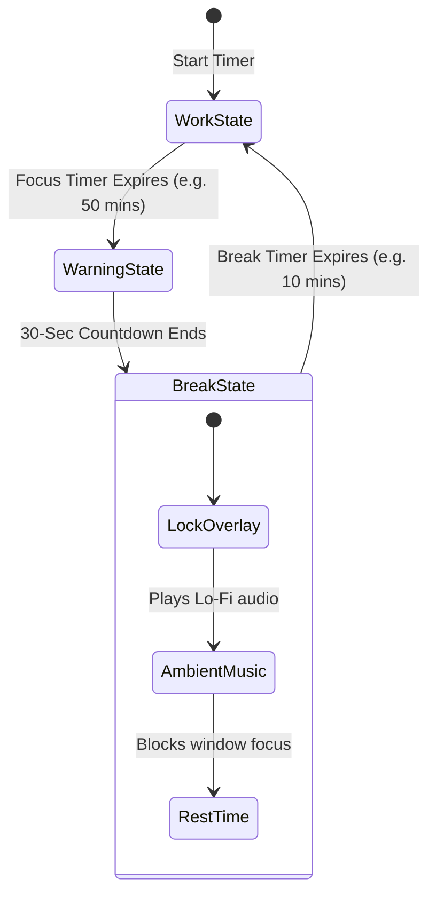

# Time Out: Enforced Rest Loops

**Time Out** is an automated rest-enforcement engine built to combat screen fatigue and mental burnout by locking your operating system during designated break periods.

---

## Rest Interval Architecture

Time Out takes the classic Pomodoro technique and enforces it at the OS level. It uses a structured interval state machine:

### 1. The Work Session
- You configure your target work period (e.g., 50 minutes). During this time, TimiGS runs silently in the system tray, tracking your metrics.

### 2. Pre-Break Warning
- Once the work timer expires, a subtle HUD banner appears at the top of your screen, initiating a 30-second warning countdown. This gives you time to save your code, finish a sentence, or pause a video before the block begins.

### 3. Screen Lock Block
- During the break (e.g., 10 minutes), a fullscreen, high-contrast overlay blocks your display.
- **Input Blocking**: The overlay is styled as a topmost window, making it difficult to bypass.
- **Ambient Player**: The break window features a built-in music player that streams offline-cached lo-fi beats, rain sounds, or white noise to encourage you to step away from the desk.

---

## Customization Options

Within the **Tools** tab, you can customize:
- **Strictness Level**:
  - *Standard Mode*: Shows an "Skip Break" button for emergencies.
  - *Enforced Mode*: Completely hides any bypass controls, forcing you to rest for the entire duration.
- **Audio Assets**: Manage local audio files (packaged in public resources) or select built-in relaxing tracks.
- **Overlay Customization**: Set dark glassmorphic backdrops or minimal animations.

> [!TIP]
> The primary cause of repetitive strain injuries and eye fatigue is uninterrupted sitting. Even a short 5-minute Time Out every hour can significantly reduce visual fatigue and maintain long-term focus.
