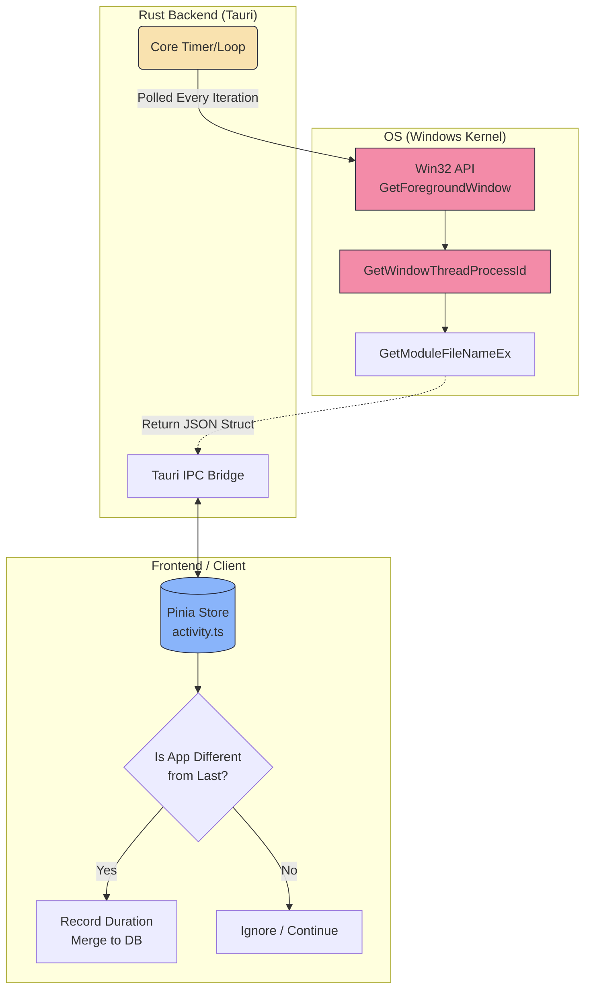
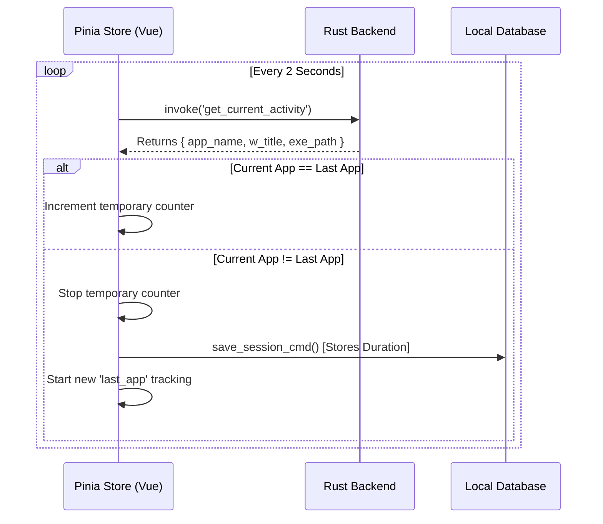

# Core Tracking Architecture

Activity tracking in TimiGS relies on a highly efficient, multi-threaded hybrid structure. A **Rust (Tauri)** backend safely interacts directly with the operating system kernel APIs to collect low-level metrics, while a **Vue.js/Pinia** frontend determines logical state, session merging, and visual categorization.

## The Observation Loop Architecture

Many tracking applications install persistent OS-level background services, which can trigger anti-viruses or consume massive idle resources. TimiGS, instead, utilizes an **active-polling** strategy bridging IPC (Inter-Process Communication) and Win32 protocols.



## OS Polling Implementation (Rust)

1. **System Call**: Rust leverages the native Win32 API to ping `GetForegroundWindow()`. This instantly retrieves the pointer handle to whatever application is currently focused on the screen.
2. **Process Inspection**: With the handle, the application invokes `GetWindowThreadProcessId` to enter the process memory tree and extract the readable `window_title`, executable core `app_name`, and absolute path `exe_path`.

## Data State Processing (Frontend)

The Vue interface commands a Javascript interval loop that continuously issues a `Tauri Invoke` command. 



### Code Example: Managing Vue Sessions

Below is the exact state-management logic that handles the delta changes when a user context-switches from one window to another (`src/stores/activity.ts`):

```typescript
function pollCurrentActivity() {
  const current = activityStore.currentActivity;
  if (!current) return;
  
  const appName = current.app_name || 'Unknown';

  // State Change Detected: The user switched focus to a new app
  if (appName !== lastActivityApp.value) {
    if (lastActivityApp.value) {
      // Find the last unclosed entry in the history buffer array
      let lastEntry = self.activityHistory.find(
          e => e.appName === lastActivityApp.value && e.durationSeconds === 0
      );
      
      // Stop the timer and calculate absolute time elapsed difference
      if (lastEntry) {
        lastEntry.endTime = Date.now();
        lastEntry.durationSeconds = Math.floor((lastEntry.endTime - lastEntry.startTime) / 1000);
      }
    }

    // Heuristically assign Work/Rest/Game depending on app name constants
    const category = detectCategory(appName, current.exe_path || '');

    // Spawn the next recording timeline element
    self.activityHistory.push({
      appName,
      windowTitle: current.window_title || '',
      category,
      startTime: Date.now(),
      endTime: Date.now(),
      durationSeconds: 0
    });

    // Reset the tracker head
    lastActivityApp.value = appName;
  }
}
```

> [!IMPORTANT]
> **Privacy Architecture:** The OS APIs accessed by Tauri are strictly Read-Only and Sandboxed. TimiGS cannot modify other foreground windows, it does not log keystrokes, and it cannot intercept network payloads. It statically reads the string title of the window you are actively visualizing.
