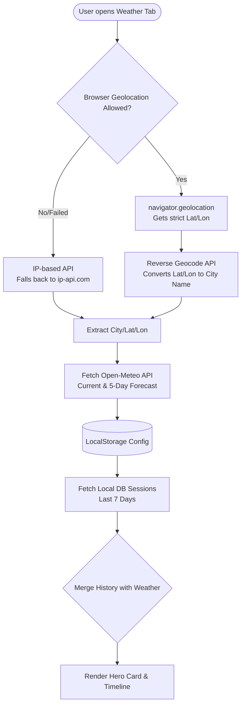
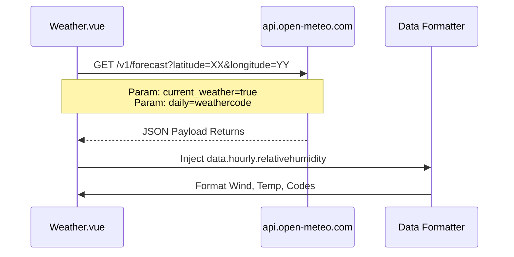

# Subsystem: Weather & Environment Tracking

The **Weather Module** brings a unique environmental context to your productivity goals. By contrasting local weather conditions against active work hours, TimiGS attempts to visualize whether atmospheric conditions impact your workflow (e.g., increased coding duration on rainy days).

## Architecture & Data Flow Mechanism

TimiGS uses a combination of built-in web standards, IP routing fallback services, and open-source APIs to map out weather timelines accurately.

### The Component Workflow



## Step 1: Geolocation Protocol

Because Tauri wraps webviews securely, strict HTML5 Geolocation often fails due to missing permissions in the underlying desktop framework. TimiGS operates a dual-fallback algorithm.

```typescript
// src/views/Weather.vue snippet
async function useMyLocation() {
  if (!navigator.geolocation) {
    // Immediate failure handler
    await ipBasedGeolocation();
    return;
  }

  navigator.geolocation.getCurrentPosition(
    async (position) => {
      const lat = position.coords.latitude;
      const lon = position.coords.longitude;
      // Reverse geocoding to find City Name
      const res = await fetch(`https://geocoding-api.open-meteo.com/v1/search?...`);
    },
    (error) => {
      // Tauri permission denial handler
      ipBasedGeolocation(); 
    }
  );
}
```

## Step 2: Open-Meteo API Fetching

With geographic coordinates acquired, TimiGS calls the free, non-authenticated **Open-Meteo** API. It requests highly specific data points to minimize payload size.



The payload is processed through a switch-state mapper `getWeatherDesc(code)` to translate technical weather codes (like `71`) into readable statuses (`Light Snow`) and assign standard SVG imagery.

## Step 3: Historical Interpolation

The true value of this module lies in the "Activity Timeline." TimiGS compares the past 7 days of activity directly against the cached weather data for those specific days.

1. Retrieves the last 7 days of SQLite `ActivitySession` entries.
2. Formats all timestamps down to Local Day markers (`2026-04-20`).
3. Groups durations via a reduction algorithm by `app_name`.
4. Stitches the generated `AppUsage` struct into a newly built `HistoryEntry` JSON object that includes the `weatherCode` for that matching day.

```typescript
for (let i = 0; i < days; i++) {
    // Generate date string for matching
    const dateStr = getLocalDateStr(date);
    const daySessions = sessions.filter(s => s.start_time.startsWith(dateStr));
    
    // Reduces multiple app sessions into cumulative totals
    const appMap: Record<string, number> = {};
    daySessions.forEach(s => {
        if (!appMap[s.app_name]) appMap[s.app_name] = 0;
        appMap[s.app_name] += s.duration_seconds;
    });

    const forecastDay = forecast.value.find(d => d.date === dateStr);
    
    // Builds final array for the Timeline rendering
    newHistory.push({
        date: dateStr,
        weatherCode: forecastDay ? forecastDay.code : null,
        apps: topApps // The sorted cumulative app objects
    });
}
```

> [!CAUTION]
> The Open-Meteo API enforces rate limits on a per-IP basis (10,000 calls per day). TimiGS handles logic entirely Client-Side, completely protecting the app's scalability from central server throttling. 
